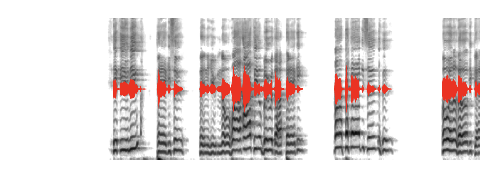

# Wavesurfer Overlay Plugin


This plugin adds image overlay/underlay capabilities to a `wavesurfer.js` instance, allowing for audio-synced visualizations such as spectrograms, waveform analyses, or any other time-aligned images.

## Features

- **Overlay or Underlay** - Position images either in front of or behind the waveform
- **Multiple Images** - Stack multiple visualization layers with different opacities
- **Responsive Zoom** - Images automatically adjust when zooming in or out of the waveform
- **Customizable Opacity** - Control transparency for each image layer
- **Cursor Support** - Ensures the playback cursor remains visible in all modes
- **Waveform Hiding** - Option to hide the waveform entirely while showing only visualizations

## Installation

### npm

```bash
npm install wavesurfer-overlay-plugin
```

### Direct Download

You can also download the files directly from the GitHub repository and include them in your project.

## Usage

### Basic Usage

```javascript
import WaveSurfer from 'wavesurfer.js';
import OverlayPlugin from 'wavesurfer-overlay-plugin';

// Create a WaveSurfer instance
const wavesurfer = WaveSurfer.create({
  container: '#waveform',
  height: 300,
  waveColor: 'rgb(200, 200, 200)',
  progressColor: 'rgb(100, 100, 100)',
});

// Load audio
wavesurfer.load('audio.mp3');

// Create and register the overlay plugin
const overlayPlugin = OverlayPlugin.create({
  imageUrl: './spectrogram.png',
  opacity: 0.8,
  position: 'underlay'
});

wavesurfer.registerPlugin(overlayPlugin);
```

### Configuration Options

The plugin accepts the following options:

| Option | Type | Default | Description |
|--------|------|---------|-------------|
| `imageUrl` | `string` or `string[]` | *Required* | URL or array of URLs for the overlay image(s) |
| `container` | `HTMLElement` or `string` | *wavesurfer container* | Container element or selector string for the overlay |
| `backgroundColor` | `string` | `"transparent"` | Background color of the overlay container |
| `duration` | `number` | *wavesurfer duration* | Duration of the audio in seconds (if not provided, will use WaveSurfer's duration) |
| `opacity` | `number` or `number[]` | `0.3` | Opacity value(s) for the overlay image(s) (0-1) |
| `position` | `"overlay"` or `"underlay"` | `"overlay"` | Position of the overlay relative to the waveform |
| `hideWaveform` | `boolean` | `false` | Whether to hide the waveform completely |

### Multiple Layers

You can stack multiple visualization layers by providing arrays for `imageUrl` and `opacity`:

```javascript
const overlayPlugin = OverlayPlugin.create({
  imageUrl: ['./pitch_contour.png', './spectrogram.png'],
  opacity: [0.9, 0.7],
  position: 'underlay'
});
```

### Events

The plugin emits the following events:

- `ready` - Fired when the overlay is ready and rendered
- `destroy` - Fired when the plugin is destroyed

```javascript
overlayPlugin.on('ready', () => {
  console.log('Overlay is ready');
});
```

## CSS Styling

The plugin creates elements with the following part attributes that can be styled using the `::part()` pseudo-selector:

```css
/* Style the overlay wrapper */
#waveform ::part(overlay-wrapper) {
  /* Custom styles */
}

/* Style a specific layer */
#waveform ::part(overlay-layer-0) {
  /* Custom styles for the first layer */
}
```

## Example with Zoom Plugin

Here's a complete example combining the Overlay plugin with the Zoom plugin:

```javascript
import WaveSurfer from 'wavesurfer.js';
import OverlayPlugin from 'wavesurfer-overlay-plugin';

// Create WaveSurfer instance
const wavesurfer = WaveSurfer.create({
  container: '#waveform',
  height: 300,
  waveColor: 'red',
  progressColor: 'green',
  url: 'audio.mp3'
});

// Initialize overlay plugin with an image e.g a spectrogram
const overlayPlugin = OverlayPlugin.create({
  imageUrl: './spectrogram.png',
  opacity: 1,
  position: 'underlay'
});

// Register plugin
wavesurfer.registerPlugin(overlayPlugin);


```

## Best Practices

For the best visual results:

1. **Image Dimensions**: Use images with width proportional to the audio duration to ensure proper alignment
2. **Resolution**: Higher resolution images may require more opacity adjustment for clear visualization
3. **Multiple Layers**: When using multiple layers, decrease opacity for deeper layers or ensure color contrast for accessibility

## Browser Compatibility

This plugin is compatible with all browsers that support wavesurfer.js.

## Development

For local development:

```bash
npm install
npm run dev
```

## License

MIT
